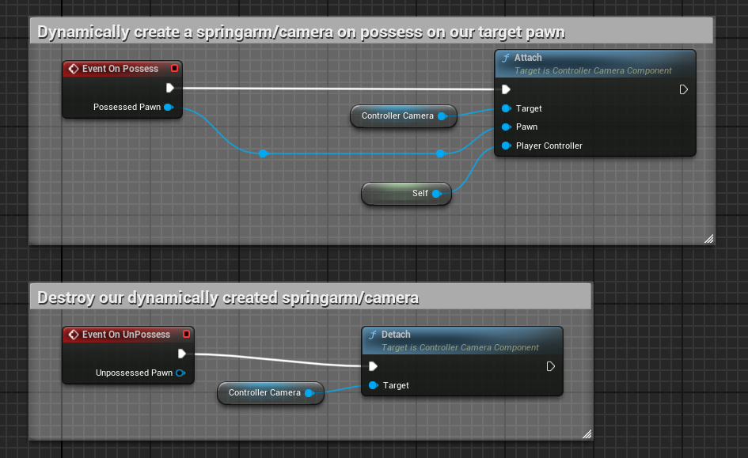

# Controller Camera

## Objective

By default, many Unreal Engine project templates include a Camera on every Character.

For some games it might be desireable not to have a Camera/Springarm on every character, and instead only use a single Camera that "moves" to the specific character you happen to be possessing.

This simple dependentless ActorComponent is designed to spawn a SpringArm and Camera from your PlayerController, and then attach itself to an incoming possessed character. Cleanup function included for unposessing as well.

## Usage

1. Add the ControllerCameraComponent to your PlayerController.
2. Listen to the On Possess and On UnPossess Events, and trigger Attach and Detach respectively.

